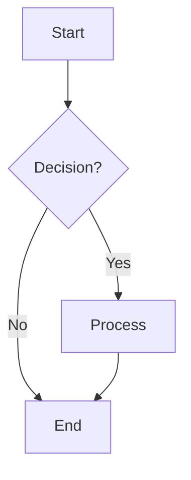
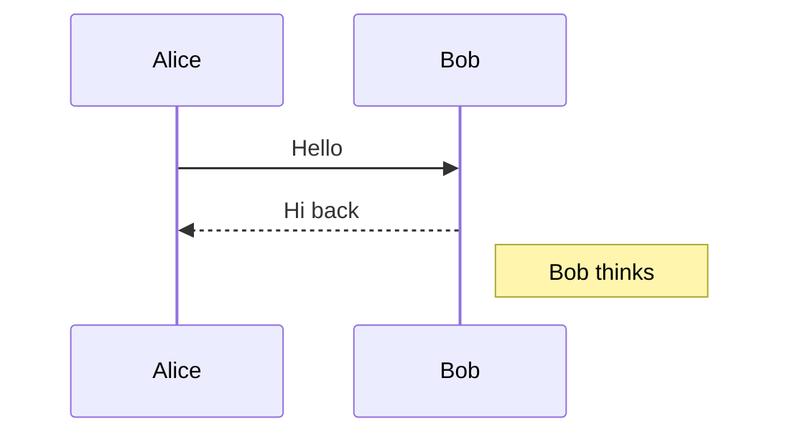
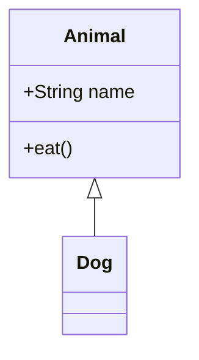
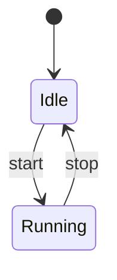
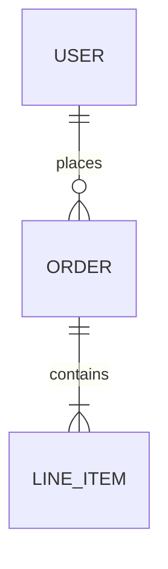
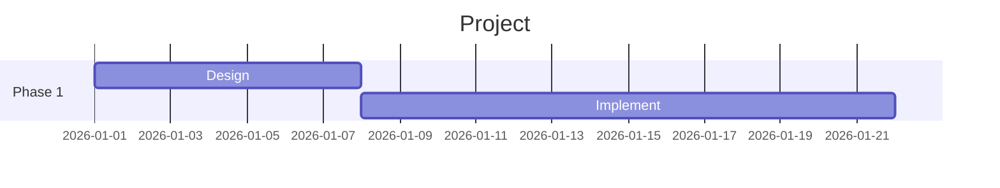

# Mermaid Syntax Cheatsheet

A compact reference for generating valid Mermaid diagrams. ALWAYS wrap node text containing
spaces, punctuation, or special characters in **double quotes**.

## Flowchart (most common)

Directions: `TD` (top-down), `LR` (left-right), `BT`, `RL`.

Node shapes: `A["text"]` rect, `B("text")` rounded, `C{"text"}` rhombus, `D[("DB")]` cylinder, `E(("circle"))`.

Arrows: `-->`, `---`, `-.->` (dotted), `==>` (thick), `--label-->` (with label).

## Sequence Diagram

## Class Diagram

## State Diagram

## ER Diagram

## Gantt

## Common pitfalls

- Wrap node text containing spaces or punctuation in `"..."`. Bad: `A[Step 1?]`. Good: `A["Step 1?"]`.
- Avoid line breaks inside node text — use ` ` instead.
- Subgraph titles are quoted: `subgraph "My Group"`.
- Comment lines start with `%%`.
- Reserved words (`end`, `class`, `style`) need quoting if used as text.
