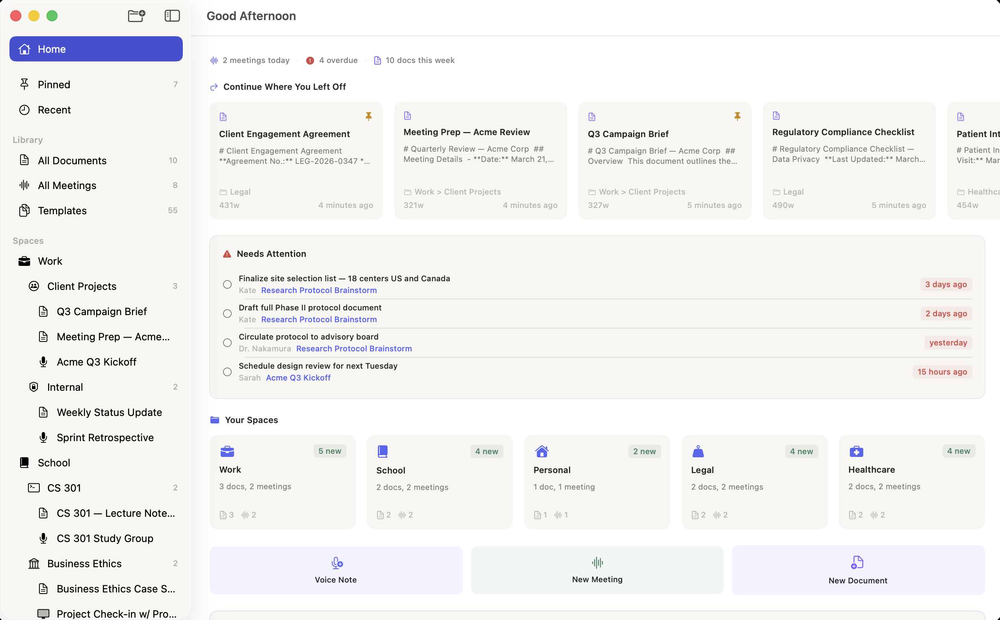
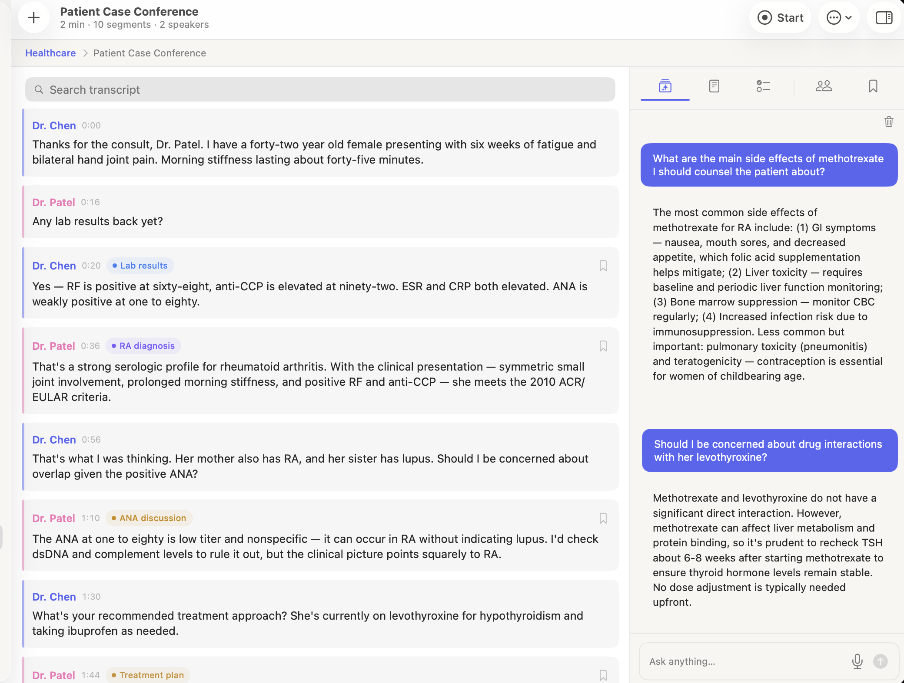
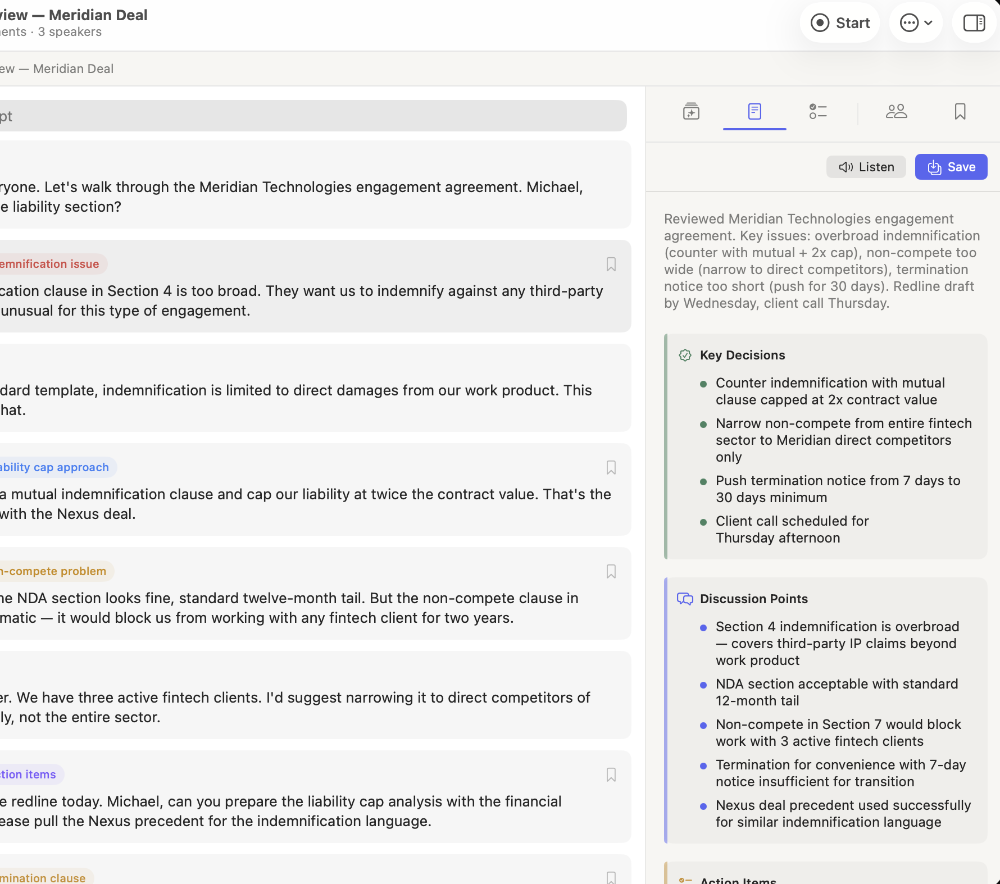
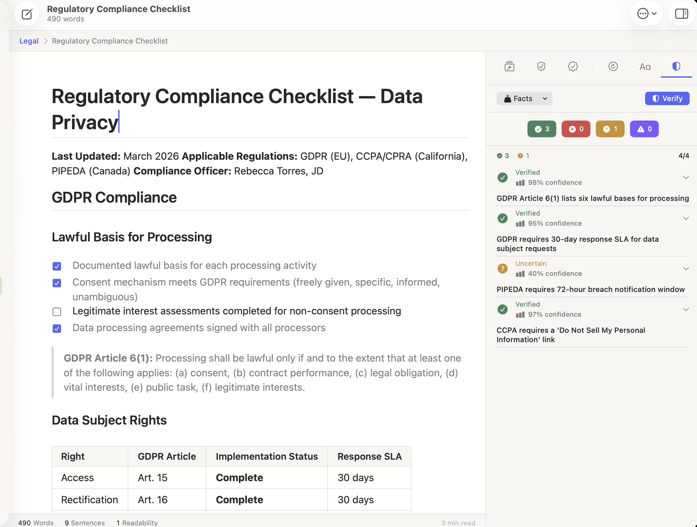
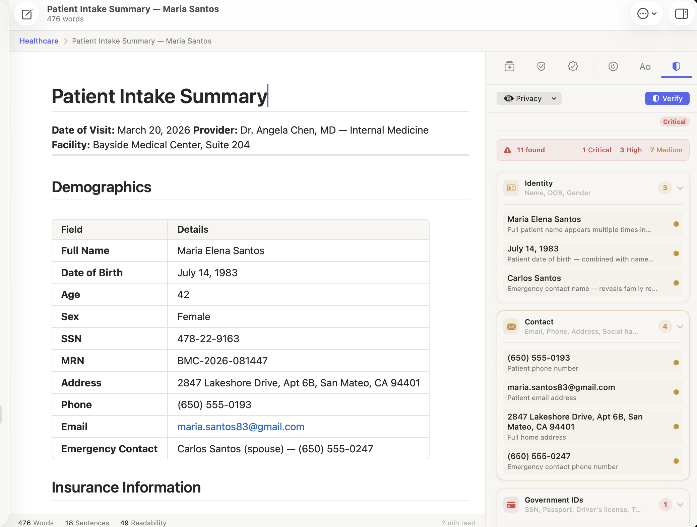

<p align="center">
  <a href="https://bitwize.ai">
    
  </a>
</p>

<h1 align="center">Logue</h1>

<p align="center">
  <b>Privacy-first AI meeting notes & writing assistant for macOS.</b><br/>
  On-device transcription, Smart Minutes, and 60+ writing modes — all powered by Apple Silicon. Nothing leaves your Mac.
</p>

<p align="center">
  <a aria-label="License: MIT" href="https://github.com/bitwize-ai/Logue/blob/main/LICENSE" target="_blank">
    
  </a>
  <a aria-label="macOS version" href="https://www.apple.com/macos/" target="_blank">
    
  </a>
  <a aria-label="On-Device AI" href="https://bitwize.ai" target="_blank">
    
  </a>
  <a aria-label="Contact Bitwize" href="mailto:support@bitwize.ai" target="_blank">
    
  </a>
</p>

<p align="center">
  <a aria-label="Download Logue" href="https://github.com/bitwize-ai/Logue/releases/latest"><b>Download for macOS</b></a>
&ensp;•&ensp;
  <a aria-label="Build from Source" href="#-build-from-source">Build from Source</a>
&ensp;•&ensp;
  <a aria-label="Contributing" href="CONTRIBUTING.md">Contributing</a>
&ensp;•&ensp;
  <a aria-label="Request a feature" href="https://github.com/bitwize-ai/Logue/issues">Request a feature</a>
</p>

<p align="center">
  
</p>

## Introduction

Logue is a privacy-first AI meeting-notes and writing assistant for macOS. It combines
real-time audio transcription, speaker diarization, and intelligent document editing —
all powered entirely **on-device via MLX on Apple Silicon**. By default your meetings,
notes, and conversations stay on your Mac — the only network calls are on-device model
downloads, update checks, and the opt-in features you explicitly enable (web search and
external AI providers).

This repository contains the full Logue app source: the LLM engine, recording pipeline,
agentic AI chat, writing editor, and test suites. [Bitwize](https://bitwize.ai) builds
Logue for professionals and students who want the full power of AI without sacrificing
privacy.

New here? Read [CONTRIBUTING.md](CONTRIBUTING.md) to get set up and learn the standards
every pull request follows.

## Table of contents

- [✨ Features](#-features)
- [🖼 Screenshots](#-screenshots)
- [📥 Install (users)](#-install-users)
- [🚀 Build from Source](#-build-from-source)
- [⚙️ Configuration](#-configuration)
- [📚 Documentation](#-documentation)
- [🗺 Project Layout](#-project-layout)
- [👏 Contributing](#-contributing)
- [❓ FAQ](#-faq)
- [📄 License](#-license)

## ✨ Features

### 🎙 Meeting Intelligence

- **Real-time transcription** — powered by Apple's `SpeechTranscriber` (macOS 26+), streaming audio directly with no buffering delays
- **Speaker diarization** — identifies and labels individual speakers using FluidAudio's Sortformer model, with a batch fallback for accuracy
- **System audio capture** — records mic and system audio simultaneously via ScreenCaptureKit; no meeting bot joins your call
- **Smart Minutes** — generates structured summaries with key decisions, themes, and follow-ups
- **Smart transcript highlights** — AI automatically extracts the most important moments; manual bookmarks are always preserved
- **Action item extraction** — pulls tasks, owners, and due dates from the transcript automatically
- **Meeting prep briefing** — AI-generated context brief before a meeting starts, based on linked documents and prior notes
- **Meeting ↔ Document links** — bidirectional links between meetings and related documents with back-link chips in the editor

### ✍️ AI Writing Editor

- **Block-based rich text editor** — built on `NSTextView` with full SwiftUI integration
- **Grammar & clarity suggestions** — inline AI-powered suggestions with one-tap acceptance
- **Tone analysis** — detects and adjusts the tone of selected text
- **Vocabulary enhancement** — suggests richer alternatives, validated against the actual document content
- **Rewrite & review panels** — rewrite selected passages or get structural feedback on the whole document
- **Fact verification** — flags claims that may need a source
- **Table support** — full table creation, editing, and context menus inside the editor
- **Writing goals** — set and track word count, reading level, and tone targets

### 🤖 Ask Logue — Agentic AI Chat

- **Multi-step agentic reasoning** — powered by LangGraph-Swift; plans, reasons, and executes multi-step workflows
- **Streaming responses** — live token-by-token output with animated indicators
- **Inline diagrams & LaTeX** — renders Mermaid diagrams and math expressions directly in the chat thread
- **Deep research mode** — progress tracking for long-running multi-source research tasks
- **Tool execution UI** — shows exactly what actions the agent is taking, with approval controls
- **Sources panel** — lists every document and meeting the agent consulted
- **Persistent memory & history** — the agent remembers context across conversations, all searchable

### 🔍 Search, Tasks & Discovery

- **Unified ⌘K search** — searches across documents, meetings, and action items in one keystroke, with keyword-centered snippets
- **Full-text search (FTS5)** — fast, ranked full-text search across all meeting transcripts and document bodies
- **Action item dashboard** — every task from every meeting in one place, with smart filters (All / Pending / Overdue / Today / This Week / Completed), sort, search, and a live sidebar overdue badge

### 🔒 Privacy & Security

- **On-device AI by default** — inference, transcription, and diarization run locally via MLX on Apple Silicon; no content is sent to any cloud service unless you opt into web search or an external AI provider
- **AES-256-GCM encryption at rest** — all meeting data and documents are encrypted on disk
- **No account required** — download and start working; there's no sign-up, no telemetry gate, no cloud dependency
- **Sandboxed release builds** — App Sandbox is enabled in production, and every entitlement exception is documented

## 🖼 Screenshots

| Meeting transcription + Ask Logue | Smart Minutes |
| :---: | :---: |
|  |  |

| AI writing editor with fact-checking | On-device PII detection |
| :---: | :---: |
|  |  |

## 📥 Install (users)

**Requirements:** macOS 26.0 (Tahoe) or later on Apple Silicon (M1 or newer).

1. Download the latest `Logue-<version>.dmg` from the [**Releases**](https://github.com/bitwize-ai/Logue/releases/latest) page.
2. Open the DMG and drag **Logue** into your **Applications** folder.
3. Launch it. On first run, macOS Gatekeeper may prompt — right-click the app → **Open**.

**Updates** are delivered in-app via Sparkle: Logue checks the GitHub-hosted feed on
launch and prompts you to install new versions. Updating only replaces the app —
your meetings, documents, and downloaded models are stored separately and are never
touched. To update manually, download the newest DMG and drag it over the old app.

## 🚀 Build from Source

**Prerequisites:** macOS 26.0+ (Tahoe) on Apple Silicon, Xcode 26+ (it ships the macOS 26 SDK required by `SpeechTranscriber`), and [XcodeGen](https://github.com/yonaskolb/XcodeGen).

**1. Clone with submodules** (vendored dependencies live under `Vendor/`):

```bash
git clone --recurse-submodules https://github.com/bitwize-ai/Logue.git
cd Logue
```

**2. Download the Metal toolchain** (one-time; required by MLX):

```bash
xcodebuild -downloadComponent MetalToolchain
```

**3. Install tooling and generate the Xcode project:**

```bash
brew install xcodegen swiftformat swiftlint
xcodegen generate
```

**4. Build and run** — open in Xcode and hit **Run**, or from the CLI:

```bash
# The signing flags let you build without an Apple Developer account.
xcodebuild build -project Logue.xcodeproj -scheme Logue -destination 'platform=macOS' \
  CODE_SIGN_IDENTITY="-" CODE_SIGNING_REQUIRED=NO CODE_SIGNING_ALLOWED=NO
open Logue.xcodeproj
```

> Already cloned without submodules? Run `git submodule update --init --recursive`.
> Re-run `xcodegen generate` whenever you add/remove `.swift` files or edit `project.yml`.

Dev builds use ad-hoc signing with the sandbox off — no Apple Developer account
needed just to build and run. (In Xcode, if the build stops at signing, either
pick your team under **Signing & Capabilities** or use the CLI flags above.) Full linting and git-hook setup are in
[`docs/dev-setup.md`](docs/dev-setup.md).

## ⚙️ Configuration

Logue runs fully on-device out of the box — **no keys or accounts are required** to
build, run, or use it. Everything below is optional and only relevant if you fork
the project or cut your own signed releases. Nothing is hardcoded to secrets: all
credentials are read from your own environment / GitHub Actions secrets.

**Optional external AI providers.** Alongside the on-device MLX models, you can add
OpenAI-/Anthropic-compatible or OpenRouter/Ollama/LM Studio endpoints under
**Settings → Models**. Keys are entered in-app and stored in your macOS Keychain —
never in the repo.

**Running your own signed builds / releases.** To ship notarized builds under your
own identity, set these as **GitHub Actions repository secrets** (the release
workflow reads them — none are committed):

| Secret | Purpose |
| --- | --- |
| `APPLE_TEAM_ID` | Apple Developer Team ID |
| `APPLE_CERTIFICATE_BASE64` / `APPLE_CERTIFICATE_PASSWORD` | "Developer ID Application" cert (base64 `.p12` + password) |
| `APPLE_ID` / `APPLE_APP_PASSWORD` | Apple ID + app-specific password for notarization |
| `SPARKLE_PRIVATE_KEY` | EdDSA key that signs auto-update ZIPs |

For a signed fork you'll also want to change, in [`project.yml`](project.yml):

- the **bundle identifier** (`PRODUCT_BUNDLE_IDENTIFIER`, default `com.bitwize.logue`);
- the **iCloud container identifiers** (`iCloud.com.bitwize.logue`) in
  [`Logue.entitlements`](Logue/Resources/Logue.entitlements) — these are tied to your Apple
  Developer account, so point them at a container you own if you want iCloud sync (or remove
  them). The shipped **release** entitlements don't include iCloud, so signed release builds
  aren't affected;
- to run your own update channel, `SUFeedURL` + `SUPublicEDKey`.

Building and running unsigned dev builds needs none of the above. See
[`docs/dev-setup.md`](docs/dev-setup.md) and
[`docs/SPARKLE_UPDATE_FLOW.md`](docs/SPARKLE_UPDATE_FLOW.md).

## 📚 Documentation

- [Developer Setup](docs/dev-setup.md)
- [Contributing Guide](CONTRIBUTING.md)
- [Sparkle Update Flow](docs/SPARKLE_UPDATE_FLOW.md)
- [Scripts Reference](scripts/README.md)
- [Security Policy](SECURITY.md)

## 🗺 Project Layout

- [`Logue/`](/Logue) — Main Swift source; SwiftUI + AppKit application target.
- [`Logue/Engine/`](/Logue/Engine) — LLM inference actor, prompt builders, and retry helpers. All AI logic lives here.
- [`Logue/Services/`](/Logue/Services) — Recording pipeline, transcription, speaker diarization, encryption, and scheduling services.
- [`Logue/Views/`](/Logue/Views) — All SwiftUI views: Meeting workspace, Writing editor, Ask Logue chat, Action items, Settings, and more.
- [`LogueTests/`](/LogueTests) — Swift Testing suites (`@Suite`, `@Test`), including real-inference LLM integration tests.
- [`Vendor/`](/Vendor) — Vendored git submodule dependencies — no remote access required at build time.
- [`docs/`](/docs) — Developer setup and release documentation.
- [`scripts/`](/scripts) — Release build script, Sparkle appcast updater, and export options plist.

## 👏 Contributing

Contributions are welcome! Read [CONTRIBUTING.md](CONTRIBUTING.md) for setup and the
security, concurrency, and SwiftLint standards enforced on every pull request. The full,
always-current ruleset the project builds against lives in [CLAUDE.md](CLAUDE.md).

Found a bug or have an idea? [Open an issue](https://github.com/bitwize-ai/Logue/issues).

## ❓ FAQ

Have questions about using Logue? Check the [FAQ on our site](https://bitwize.ai/#faq),
or email us at [support@bitwize.ai](mailto:support@bitwize.ai).

## 📄 License

Logue is open source under the [MIT License](LICENSE) — © 2026 [Bitwize](https://bitwize.ai).

Some vendored dependencies under [`Vendor/`](/Vendor) are licensed separately (MIT, BSD,
Apache-2.0); see each package for details.
